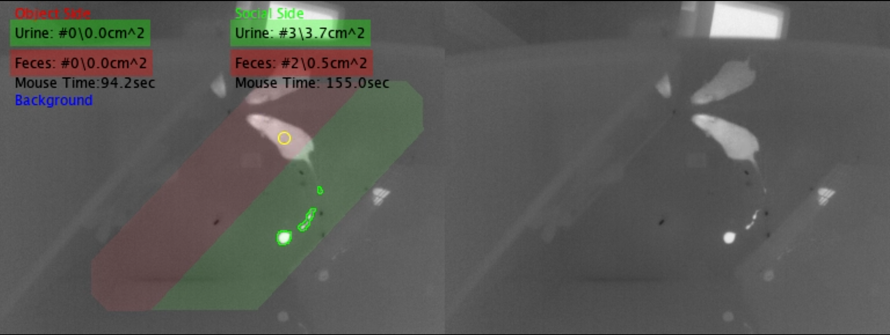

<h1>DeePosit: an AI-based tool for detecting mouse urine and fecal depositions from thermal video clips of behavioral experiments</h1>
   


<h2>Overview</h2>
This code allows the automatic detection of urine and fecal depositions in the thermal video of rodents during behavioral experiments. The algorithm is described in the paper mentioned in the title and is available here: https://www.biorxiv.org/content/10.1101/2024.06.24.600419v1.
It is based on a preliminary hot blob detector and a classifier, which is used to classify each preliminary detection as either urine\feces or background (i.e., not urine or feces). The classifier code is based on the code published by:
https://github.com/facebookresearch/detr . Additional supplementary videos are available [here](https://drive.google.com/drive/folders/1aM5tyACrXu9ehU_l_mNC5irGlsp0L6i_?usp=drive_link).
<h2>Project structure</h2>  

1. DeePosit subfolder includes the code for the preliminary detection algorithm as well as the classifier. The project includes both Matlab and Python code. The code was developed in Windows but can probably run in Linux as well.  

2. ExampleOfResults subfolder includes a video demonstrating the automatic detection of urine (marked in green) and feces (marked in red). Preliminary detections that were classified as background are marked in blue.
   
3. FigStat includes additional statistical data for the figures in the paper.
   
4. Thermapp_VideoRecordingCode includes the code for recording video with the Opgal's IR Thermapp MD infrared camera which was used in this project. To use this code, you will need a PC with Linux, a Thermapp MD camera, and the SDK of the camera (you will need to contact Opgal for the SDK).
   
5. VideoDatabase includes a recorded video which can be used to try the code. It should be downloaded from this [link](https://drive.google.com/file/d/1ICq_LorzK8Vlk3Shse2zbUK72bZrGR_6/view?usp=drive_link) and extrated in the project folder.  VideoDatabase\IR_Raw_Data contains the IR video, and VideoDatabase\Raw data contains the matching visible wavelength video (visible wavelength video exists only for the trial period).


<h2>Getting Started</h2>

1. Prerquists for running the automatic urine and feces detection: A PC with at least 32GB of RAM and a GPU with at least 4GB of memory,  Matlab R2020b or higher, Python 3.9 , Cuda Version 11.3 or higher.  To record thermal videos with Thermapp MD IR camera you will need a PC with Ubuntu. See Thermapp_VideoRecordingCode\Readme.md for more details.

2. Create a folder for the project, open console (in Windows, press on start, write cmd, and press enter). In the console, write:  

```
   cd YourProjectFolder
   git clone https://github.com/davidpl2/DeePosit
```

The repository will be downloaded into the folder: YourProjectFolder\DeePosit

3. Download VideoDatabase from this [link](https://drive.google.com/file/d/1ICq_LorzK8Vlk3Shse2zbUK72bZrGR_6/view?usp=drive_link) and extract it into the folder: YourProjectFolder\DeePosit\. Check that the file vidsID.csv is located in: YourProjectFolder\DeePosit\VideoDatabase\vidsID.csv (and not in YourProjectFolder\DeePosit\VideoDatabase\VideoDatabase\vidsID.csv)

4. To see the IR video, open Matlab and change the current folder to YourProjectFolder\DeePosit\DeePosit. Run the Matlab script DeePositLabeler. A graphical user interface will be shown. Press on "Load Video" button and choose one of the bin files in the directory YourProjectFolder\VideoDatabase\IR_Raw_Data\SP\13.04.23\2F_1_SP_ICR Dup_WT_2023-04-13_13-56-32\.
   
5. Note that the DeePositLabeler can be used to manually annotate the videos. Specifically, it may be used to manually select the frame range for the habituation period and the trial period, to annotate the polygon of the arena floor in habituation and trial periods, and to annotate the blackbody surface (in habituation and trial). These annotations are required before the automatic detection algorithm can run. As this example video is already annotated, these annotations will be overlayed. Manually labeled urine and feces will be saved in an Excel file named GT_Detections.xlsx inside the video directory (the labeling of urine and feces is not used by the automatic detection algorithm). Other annotations (arena's floor, black body, indexes of first and last frame of habituation and trial periods, sides of stimulus1 and stimulus2) will be saved in BBandCageContours.xml in the same directory. See DeePosit\DeePositLabelerManual.docx for more details.
   
6. To run the automatic detector, create a virtual environment with python 3.9 by running in console:
```
cd YourProjectFolder
PathToPython3.9\python -m venv YourVirtualEnvironmentName
```

7. Activate the virutal environment by running in console (syntax for Windows):
```
YourProjectFolder\YourVirtualEnvironmentName\Scripts\activate 
```  
8. In the same console (from within the virtual environment), install requirements for the classifier using:
```
pip install -r YourProjectFolder\DeePosit\DeePosit\Classifier\requirments.txt
```
   
9. Edit the file YourProjectFolder\DeePosit\DeePosit\getParams.m and change the following line to point to the relevant python executable of the virtual environment:
```
params.pythonExe = '"YourProjectFolder\YourVirtualEnvironmentName\Scripts\python.exe"';
```
  
10. Download the pre-trained weights file from this [link](https://drive.google.com/file/d/16qVqZz5Yz_im1quljCdQ8cLIBGlrLxOY/view?usp=drive_link) and put it in the folder YourProjectFolder\DeePosit\DeePosit\Classifier\TrainedWeights.

11. In Matlab, change current directory to YourProjectFolder\DeePosit\DeePosit and run the Matlab script RunDeePositOnDB to run the preliminary detection and the classifier on all of the videos in the database (a single video is supplied in this github repository). The results will be saved in YourProjectFolder\DeePosit\DeePositDetectionResults\relative_path_of_the_input_video\DeePositRes.csv. Note that the videos in the database should be listed in the csv file: YourProjectFolder\DeePosit\VideoDatabase\vidsID.csv . Also note that videos that were already processed will be skipped (unless you delete the relevant subfolder in DeePositDetectionResults).


<h2>Training the classifier</h2>

1. To train the classifier, you will first need to generate a training and testing database. Do that by adding videos and annotate them using DeePositLabeler.m (including annotation of the urine and feces location). List the videos in the vidsID.csv and specify each video as either train or test video by putting 1 or 0 in the relevant column. Then run the RunDeePositOnDB.m with the flag GenerateTrainTestDB=true to generate the train and test database.
   
2. After generating the train and test database, change to folder DeePosit\Classifier and run the training of the classifier from within the virtual environment by running: 

```
python main.py --lr_drop 200 --lr_backbone 1e-5 --output_dir "SpecifyYourOutputDir" --epochs 500 --enc_layers 6 --dec_layers 6 --num_queries 1 --batch_size 24 --resume "SpecifyPathToPretrainWeights" --dilation --train_img_folder "SpecifyYourTrainImgsFolder" --val_img_folder "SpecifyTestImagesFolder" --bbox_loss_coef 0 --giou_loss_coef 0
```
